# Project Description

## Login Page

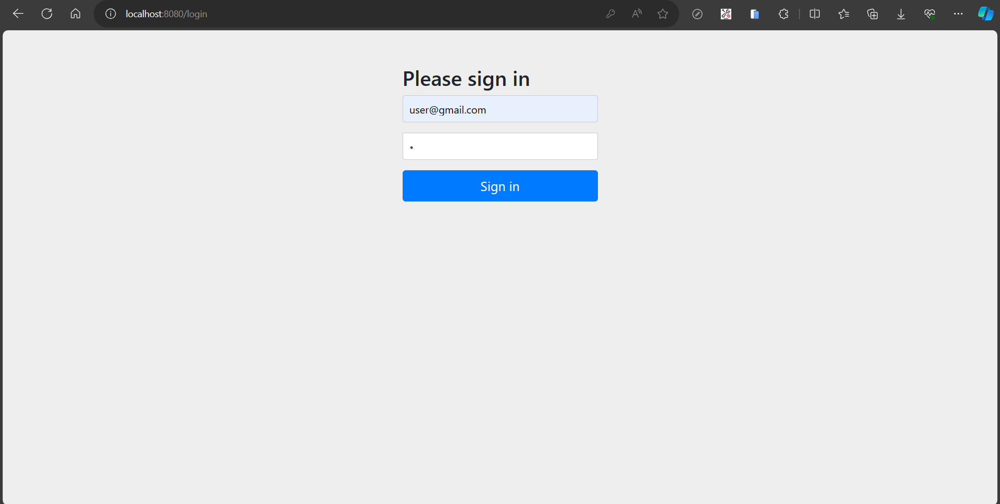

- The project starts with a login page.

## Home Page

- After successful login, users are navigated to the home page.
- On the home page, users can view their wall, posts, and add new posts.

### View User Wall

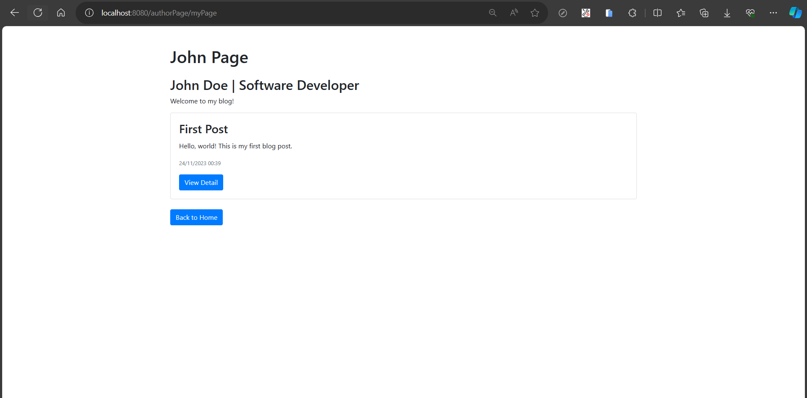

- Clicking "Go to my wall" displays the user's wall, showing their name, profile, and posts.

### Add New Post

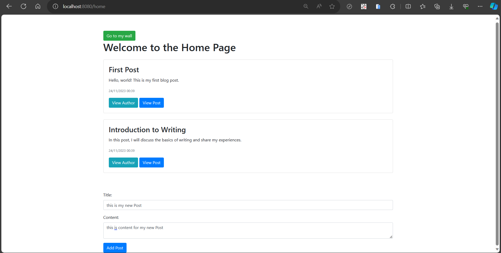

- To add a new post, users can enter a title and content and click "Add Post."

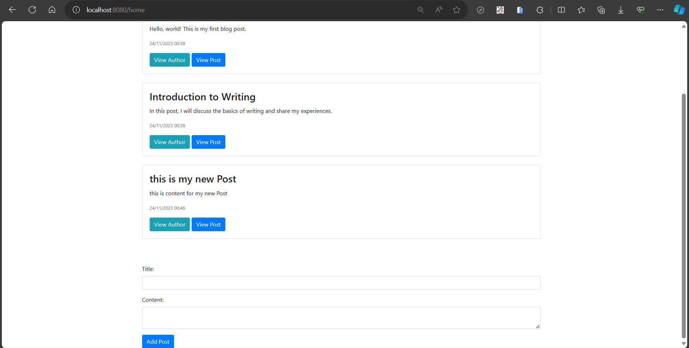

- After adding a post successfully, a confirmation message is displayed.

### Paging

#### First Page

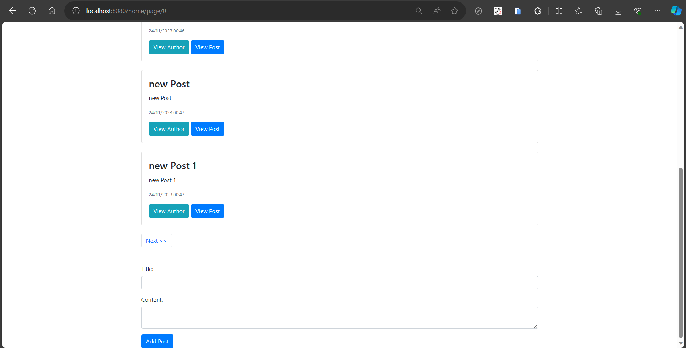

- If there are more than 5 posts, paging buttons allow users to navigate to additional pages.

#### Second Page

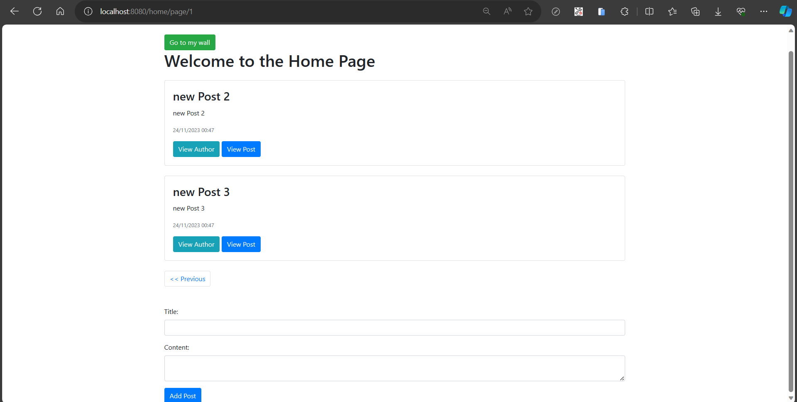

- Users can navigate to the second page using the paging buttons.

## Post Detail Page

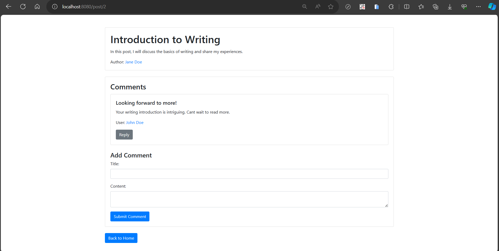

- Clicking "View Detail" on a post navigates to the Post Detail Page.

### Add Comment

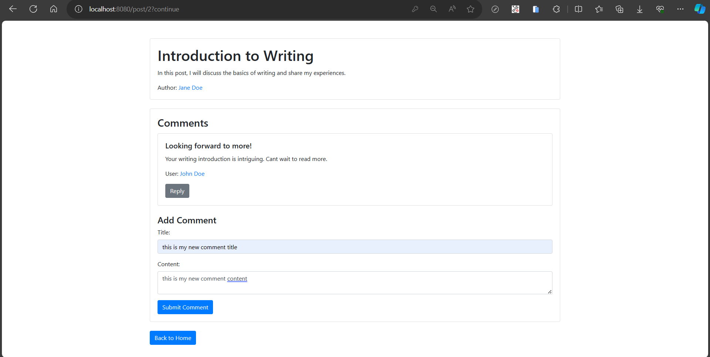

- Users can add comments to a post by entering the comment and clicking "Submit Comment."

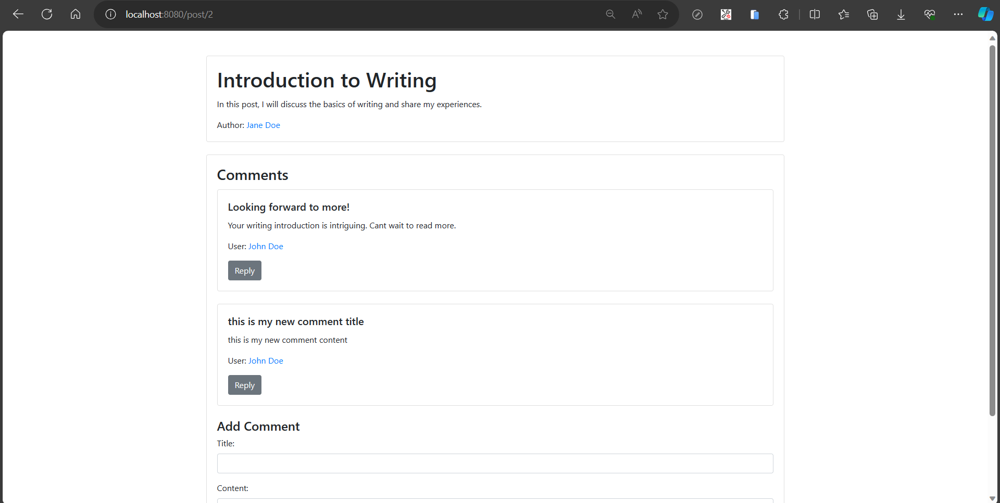

- After successfully adding a comment, a confirmation message is displayed.

### Reply to Comment

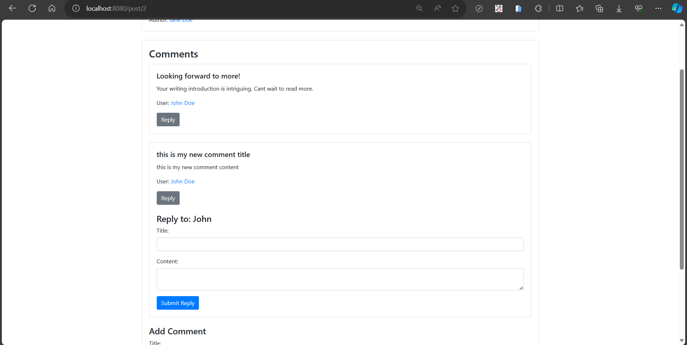

- Users can reply to existing comments by clicking "Reply."

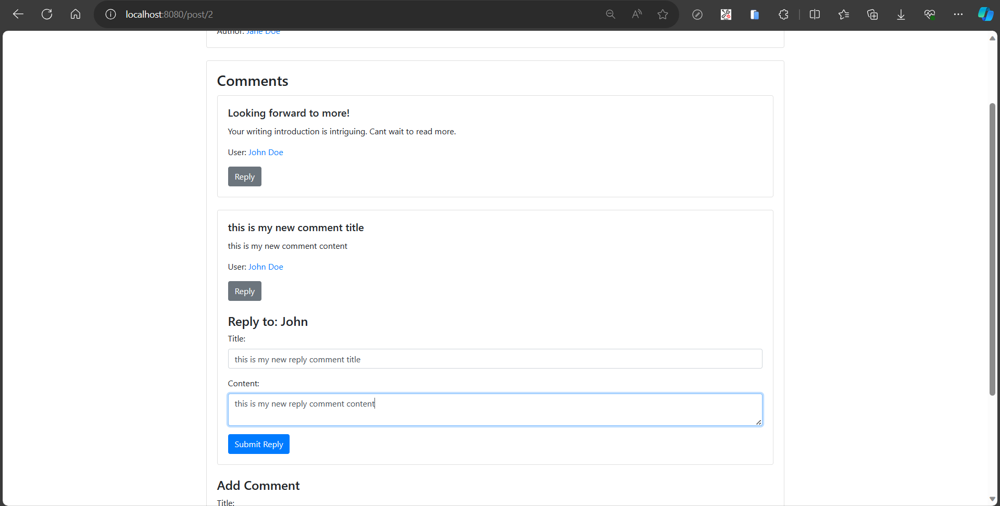

- After entering the reply comment and clicking "Submit Reply," the reply is added successfully.

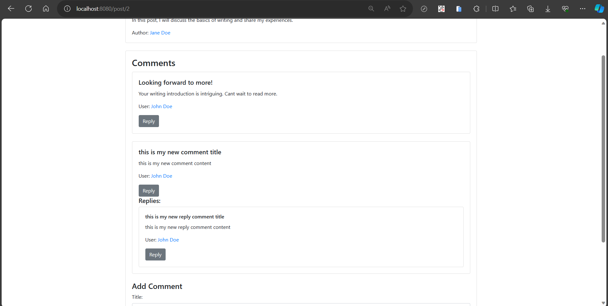

- After successfully adding a reply comment, a confirmation message is displayed.
